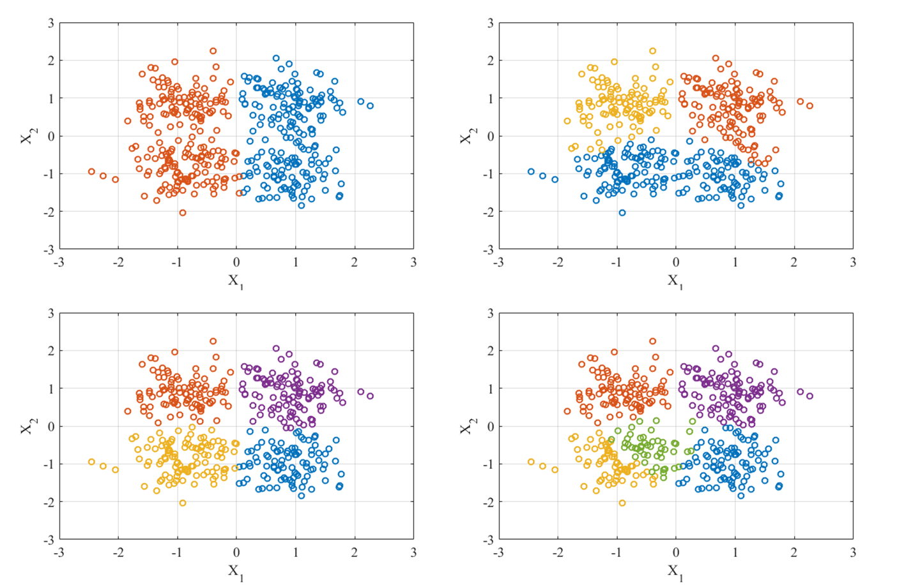
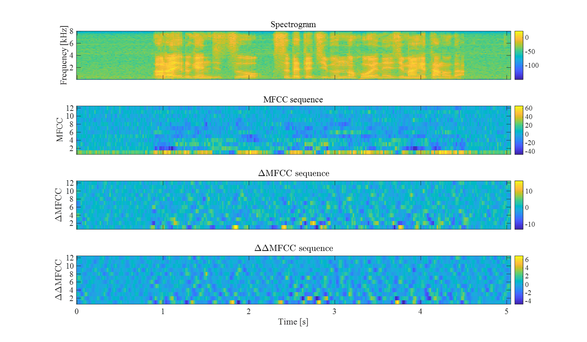

# 第五回B4輪講課題

## 課題の概要

本課題では，クラスタリングとMFCC分析を行う．

## 課題

1. データをクラスタリングしよう！
2. MFCC分析をしよう！

## 課題の進め方

1. データの準備
   - data1.csv, data2.csv, data3.csvの散布図をプロットして概形を確認
2. k-meansアルゴリズムを用いたクラスタリング
   - アルゴリズムの実装
   - 適当なクラスタ数の決定
3. MFCC分析
   - メルフィルタバンク分析
   - 離散コサイン変換して低次元成分を抽出
   - 動的変動成分(Δ，ΔΔ)もあわせて抽出
4. 発表（次週）
   - 取り組んだ内容を周りにわかるように説明
   - 発表者は当日にランダムに決めるので**スライドは全員準備**
   - 結果の考察
   - 発表資料は研究室NASにアップロードしておくこと
      `/procyon/all/発表資料\B4輪講/2021/<発表日>`


## 結果例





## ヒント

- k-meansアルゴリズムは初期値依存
  - 初期値をどのように決めるとよいか
- 処理時間を意識しましょう
  - どれだけ高速化できたか，`scipy`の実装にどれだけ近づけたか
  - pythonで実行時間を測定する方法は[こちら](http://st-hakky.hatenablog.com/entry/2018/01/26/214255)

## 注意

- 武田研究室の場合はセットアップで作成した`virtualenv`環境を利用すること  
    - アクティベート例：`source ~/workspace3/myvenv/bin/activate`  
    - アクティベート後`pip install ...`でライブラリのインストールを行う  
- 自分の作業ブランチで課題を行うこと
- プルリクエストをおくる際には実行結果の画像も載せること
- 作業前にリポジトリを最新版に更新すること

```
$ git checkout master
$ git fetch upstream
$ git merge upstresam/master
```
